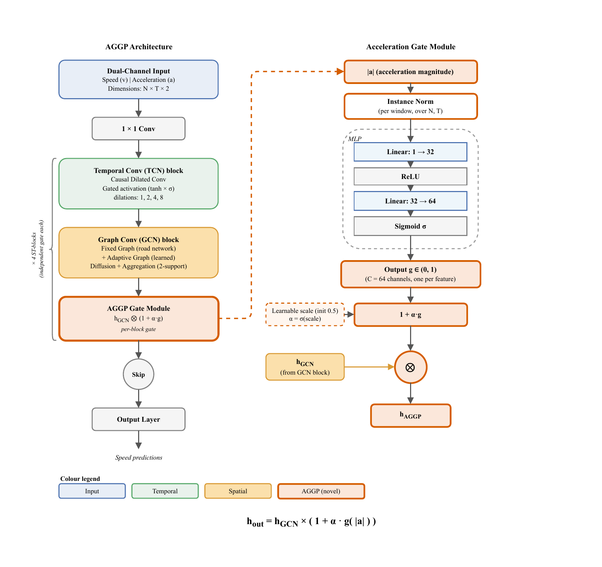

# AGGP: Acceleration-Gated Graph Propagation

Official implementation of **AGGP** — an adaptive, in-model gate that modulates the strength of graph propagation in spatio-temporal traffic forecasting using instantaneous acceleration as the gating signal.

> **"Instead of building a new graph from acceleration, we gate the output of existing graph propagation based on how fast traffic is changing."**

---

## Method Overview

Standard Graph WaveNet propagates spatial information uniformly across all timesteps. AGGP inserts an **acceleration gate** after the graph convolution of every ST-block, which:

- **Amplifies** spatial propagation during high-acceleration events (shockwaves, stop-and-go)
- **Dampens** propagation during steady-state traffic, where local features suffice

**Formulation:**

```
g(t)   = Sigmoid( MLP( InstanceNorm( |a(t)| ) ) )    ∈ (0, 1)
x_out  = x_gcn × (1 + α · g(t))
```

The MLP maps `1 → 32 → 64`. The gate strength `α = σ(scale)` is a **learned** parameter, not a
fixed constant — each of the four ST-blocks carries its own independent gate and learns its own `α`.

AGGP reuses the backbone's existing 2-graph structure (fixed + adaptive); it does not construct
an additional acceleration graph.

---

## Architecture



**Left:** the pipeline — dual-channel input, four ST-blocks (each TCN → GCN → **AGGP gate**),
skip connections and the output head. **Right:** the acceleration gate — `|a|` is
instance-normalised per window, an MLP (1→32→64) maps it to a per-channel gate `g ∈ (0,1)`,
which modulates the GCN output as `h_GCN · (1 + α·g)`. Each ST-block carries its own
independent gate and learns its own `α`.

A vector version is available at [`figures/architecture.pdf`](figures/architecture.pdf).

---

## Ablation Configurations

The paper isolates the gate with five configurations. All five are runnable from this repository:

| # | Configuration | Input | Gate signal | Command |
|---|---------------|-------|-------------|---------|
| 1 | **Baseline (speed only)** | 1ch speed | — | `--model gwnet --use_acceleration false` |
| 2 | **Gate=speed** | 1ch speed | speed magnitude | `--model gwnet_aggp_gate_speed` |
| 3 | **Gate=accel** | 2ch | acceleration | `--model gwnet_aggp_gate_accel` |
| 4 | **fullAGGP** (ours) | 2ch | acceleration | `--model gwnet_aggp` |
| 5 | **Dual-input, no gate** | 2ch | — | `--model gwnet` |

Configuration 1 isolates the backbone with no acceleration anywhere. Configuration 5 supplies
acceleration as an ordinary input channel but removes the gate — the contrast between 4 and 5 is
what isolates the gating mechanism itself.

---

## Installation

```bash
git clone https://github.com/omarsaud/AGGP.git
cd AGGP
pip install -r requirements.txt
```

**Requirements:** Python 3.10, PyTorch 2.1+, CUDA 12 (tested on an NVIDIA RTX 3090, 24 GB)

---

## Data Preparation

See [`data/README.md`](data/README.md) for full instructions.

Both benchmarks (METR-LA, PEMS-BAY) come from the public
[DCRNN repository](https://github.com/liyaguang/DCRNN). Acceleration is derived from speed by a
**backward (causal) finite difference**, `a(t) = v(t) − v(t−1)`, so no future information enters
the input.

Expected directory structure:

```
data/
├── metr-la/
│   ├── scaled_speed.npy          # (34272, 207) float32
│   ├── scaled_acceleration.npy   # (34272, 207) float32
│   ├── adj_mx.pkl                # (207, 207)
│   └── normalization_params.json
└── pems-bay/
    ├── scaled_speed.npy          # (52116, 325) float32
    ├── scaled_acceleration.npy   # (52116, 325) float32
    ├── adj_mx.pkl                # (325, 325)
    └── normalization_params.json
```

---

## Training

### Single experiment

```bash
# Config 4 — full AGGP, METR-LA
python train.py --model gwnet_aggp --dataset metr-la --Q 12

# Config 1 — speed-only baseline
python train.py --model gwnet --dataset metr-la --Q 12 --use_acceleration false

# Config 2 — gate driven by speed instead of acceleration
python train.py --model gwnet_aggp_gate_speed --dataset pems-bay --Q 12

# Config 5 — acceleration as a plain input channel, no gate
python train.py --model gwnet --dataset metr-la --Q 12
```

### Full ablation

```bash
python ablation.py
```

### Hyperparameters

Defaults in `train.py`, identical across all configurations for a fair comparison:

| Parameter | Value | Notes |
|-----------|-------|-------|
| `hidden_dim` | 64 | Hidden feature dimension |
| `batch_size` | 64 | |
| `lr` | 0.001 | With `ReduceLROnPlateau` (factor 0.5, patience 5) |
| `epochs` | 100 | With early stopping (patience 15) |
| `dropout` | 0.3 | |
| `H` | 12 | Historical window |
| `seed` | 42 | |

---

## Evaluation

`evaluate.py` scores a finished run under the exact protocol used in the paper, reading the
saved predictions rather than re-running the model:

```bash
python evaluate.py --run_dir models/gwnet_aggp_metr-la_Acc_Q12 --dataset metr-la
python evaluate.py --run_dir <dir> --dataset pems-bay --per_horizon
```

### Reporting protocol

| Aspect | Convention |
|---|---|
| Test window | First **6784** samples (METR-LA) / **10368** (PEMS-BAY) of the test split, so every configuration is scored on an identical window |
| Denormalisation | One dataset-level mean/std, applied to predictions and targets alike → speeds in mph |
| MAE | Computed per horizon step, then averaged over the 12 steps |
| RMSE | Computed over all entries at once |
| MAPE | Excludes ground-truth speeds below **5 mph** |

The MAPE cut-off matters: percentage error divides by the observed speed, so
near-stationary readings yield arbitrarily large ratios that dominate the average without
reflecting forecast quality. The threshold is applied identically to every configuration
and baseline.

## Results

Full results — five configurations on METR-LA and PEMS-BAY, per-horizon breakdowns,
Diebold–Mariano significance tests, and the per-layer gate analysis — are reported in the paper.
See the Citation section below.

---

## Repository Structure

```
AGGP/
├── train.py               ← Single-experiment entry point
├── evaluate.py            ← Scores saved predictions under the paper's protocol
├── ablation.py            ← Full ablation study
├── visualize_configs.py   ← Diagram of the ablation configurations
├── figures/
│   ├── architecture.png   ← Architecture diagram
│   └── architecture.pdf   ← Vector version
├── model/
│   ├── __init__.py
│   └── aggp.py            ← AGGP model and acceleration gate
├── data/
│   ├── __init__.py
│   ├── loader.py          ← Data loading utilities
│   └── README.md          ← Data preparation instructions
├── utils/
│   ├── __init__.py
│   └── metrics.py         ← MAE / RMSE / MAPE
├── requirements.txt
├── LICENSE
└── README.md
```

---

## Data Split

A fixed 70/10/20 chronological split (train/validation/test), consistent with the DCRNN and
Graph WaveNet conventions.

---

## Citation

If you use this code, please cite:

```bibtex
@article{AbaHussen2026AGGP,
  title   = {Acceleration-Gated Graph Propagation: An Adaptive, Depth-Differentiated
             Mechanism for Spatio-Temporal Traffic Forecasting},
  author  = {Aba Hussen, Omar S. and Hashim, Shaiful J. and
             Samsudin, Khairulmizam and Shafri, Helmi Z. M.},
  journal = {Expert Systems with Applications},
  year    = {2026},
  note    = {Under review}
}
```

---

## License

Released under the MIT License — see [LICENSE](LICENSE).
